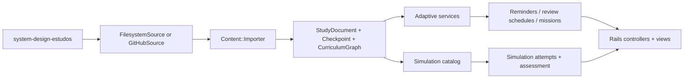

# Architecture

`system-design-study-cockpit` is a Rails application that layers an interactive study workflow on top of the Markdown repository in `system-design-estudos`. The application does not own the curriculum source of truth. It imports, normalizes, persists, and adapts that content for practice, review, and simulation.

The core pipeline is intentionally narrow:

## Source Boundary

The content repository remains external to the product boundary:

- `Content::FilesystemSource` reads a local sibling repository for development.
- `Content::GitHubSource` reads the same material through the GitHub API for production sync.
- `Content::Importer` converts source files into normalized study entities.

This keeps authorship, canonical ordering, and curriculum evolution inside `system-design-estudos` instead of duplicating them inside Rails.

## Domain Boundary

The persisted study graph is intentionally simple:

- `StudyDocument` stores imported units such as chapters, cards, labs, side tracks, and interview narratives.
- `Checkpoint` and `CheckpointAttempt` record recall and correctness events.
- `CurriculumGraph` represents the study order and cross-links.
- `StudyMission`, `LearningRecord`, `Reminder`, and `ReviewSchedule` keep lightweight learner state.
- `SimulationAttempt` and `SimulationAttemptAssessment` record simulator interaction and judgment.

These models exist to support practice and recovery loops, not to re-author the curriculum.

## Adaptive Boundary

The adaptive layer is service-driven rather than UI-driven:

- `AdaptiveSessionBuilder` turns recent learner signals into the next practice surface.
- `MisconceptionTracker` classifies misses and hesitation into durable misconceptions.
- `ReviewScheduler` creates follow-up review pressure from weak or stale signals.
- `RecordCheckpointAttempt` and `RecordSimulationAttempt` keep write paths explicit.

The goal is pragmatic adaptation: enough state to improve repetition and sequencing without pretending the app is a full tutoring system.

## Simulation Boundary

Simulations are first-class but bounded:

- `SimulationCatalog` declares the available numeric or tradeoff-driven labs.
- `SimulationEngine` evaluates server-side inputs and outcomes.
- attempts are persisted so review and reminder logic can react to simulator performance.

This keeps assessment inside the backend contract instead of trusting the browser to decide whether a learner understood the tradeoff.

## Web Boundary

Controllers and ERB views expose the study surfaces:

- dashboard, chapters, drills, library, side tracks;
- reminders, misconceptions, adaptive sessions;
- simulations and progress tracking.

The frontend is intentionally lightweight. Product behavior lives primarily in Rails services and models, which keeps the app easy to inspect for a technical reviewer.

## Operational Boundary

- Production content sync uses GitHub API instead of a writable checkout.
- Basic Auth protects the deployed cockpit with `STUDY_COCKPIT_PASSWORD`.
- Railway deploys the app with `railway.json`, `Dockerfile`, and `bin/docker-entrypoint`.
- Kamal remains documented as an optional deployment path, with the real `.kamal/secrets` kept local and ignored.

## Non-Goals

- The cockpit is not the curriculum source of truth.
- It is not a general LMS or multi-tenant education platform.
- It does not edit `system-design-estudos`.
- It does not promise a fully autonomous AI tutor.
